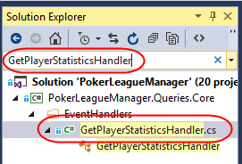
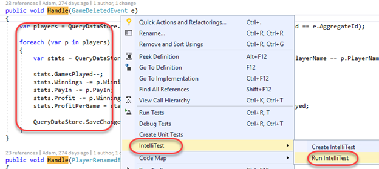
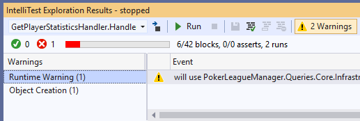
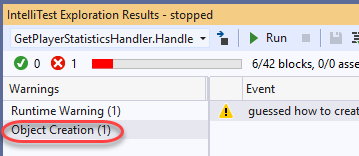
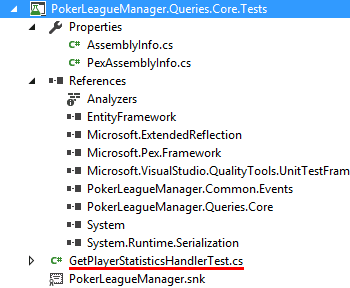
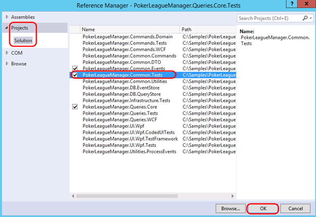
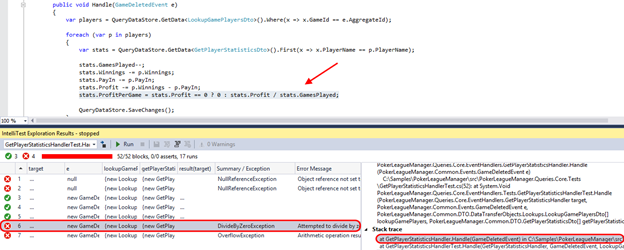

<div class="rw-ui-container"></div>
<a name="Overview"></a>
## Overview ##

IntelliTest explores your .NET code to generate test data and a suite of unit tests. For every statement in the code, a test input is generated that will execute that statement. A case analysis is performed for every conditional branch in the code. For example, if statements, assertions, and all operations that can throw exceptions are analyzed. This analysis is used to generate test data for a parameterized unit test for each of your methods, creating unit tests with high code coverage.

When you run IntelliTest, you can easily see which tests are failing and add any necessary code to fix them. You can select which of the generated tests to save into a test project to provide a regression suite. As you change your code, rerun IntelliTest to keep the generated tests in sync with your code changes.

<a name="Prerequisites"></a>
## Prerequisites ##

In order to complete this lab you will need the Visual Studio 2019 virtual machine provided by Microsoft. Click the button below to launch the virtual machine on the Microsoft Hands-on-Labs portal.

<a href="https://labondemand.com/AuthenticatedLaunch/38297?providerId=4" class="launch-hol" role="button" target="_blank"><span class="lab-details">Launch the virtual machine</span></a>

Alternatively, you can download the virtual machine from [here](../devopsvmdownload).

<a name="Exercise1"></a>
## Exercise 1: Introduction to IntelliTest ##

In practical terms, white box unit test development includes an iterative workflow informed by code coverage - write a unit test, see what parts of the code are not covered by the test, write more tests to cover those parts, repeat until all of the code is covered. This workflow is similar to what we would use while working with IntelliTest, as you will see in this exercise.

<a name="Ex1Task1"></a>
### Task 1: Running IntelliTest ###

1. Log in as **Deniz Ercoskun (VSALM\Deniz)**. All user passwords are **P2ssw0rd.**

1. Launch **Visual Studio** from the taskbar.

1. From the **Start Page**, open **PokerLeagueManager.sln**.

    

1. In **Solution Explorer**, search for **GetPlayerStatisticsHandler.cs** in the search box and then **open** the associated file in the code editor.

    

1. Scroll down and locate the **Handle** method that takes a **GameDeletedEvent** parameter (around line 31). When a Game is deleted, this method is responsible for updating the stats of the affected players. As with most real-world code, this code interacts with other objects and layers. Our goal with this demonstration is to enable IntelliTest reach 100% code coverage on the **Handle** method.

1. **Right-click** somewhere within the **Handle** method and then select **IntelliTest | Run IntelliTest**.

    

<a name="Ex1Task2"></a>
### Task 2: Understanding IntelliTest Warnings ###

1. After IntelliTest runs, only one test is generated and there is low coverage of the code (6/42 blocks). In addition, there are 2 warnings reported.

    

1. Click the **Warnings** button.

    

1. The first warning is a Runtime Warning, and it indicates that IntelliTest has discovered, and will use, "**PokerLeagueManager.Queries.Core.Infrastructure.QueryDataStore**" as **IQueryDataStore**. Browsing through the code, we can discover that **IQueryDataStore** is the type returned by the **getter** from the **QueryDataStore** property on the base class **BaseHandler**. In order to unit test this method, a concrete instantiation of this type is required. However, this may not be the type that you want to use for testing.

    

1. Select the **Object Creation** warning category. IntelliTest has also discovered publicly accessible APIs though which to instantiate **QueryDataStore** (in this case that happens to be the public constructor). The APIs need to be publicly accessible because IntelliTest needs to actually call them to instantiate the type.

    

1. Select the **Object Creation** warning. This warning alerts us about the APIs that it discovered. If we prefer, those calls could be persisted as a factory method by clicking the **Fix** button, although we will not do so now.

    

1. In addition to these types of warnings, there are also warnings available for uninstrumented methods, which are methods not tested by the tools. There are also boundary warnings that can occur when the number of branches in the code path that IntelliTest is exploring is large. In these cases, it can trip an internal boundary that has been configured for fast interactive performance. Hence, it raises a warning and stops the exploration.

<a name="Ex1Task3"></a>
### Task 3: Providing mock implementations ###

1. To proceed further, we need to answer that first question: _is that the type you want to use?_ To unit test the method, we need to provide a _mock_implementation of **IQueryDataStore**. Browsing through the solution, we can discover a **FakeQueryDataStore**. Let's tell IntelliTest to use that (instead of the **QueryDataStore** that it discovered).

1. To start assisting IntelliTest like this, we first need to setup the **Parameterized Unit Test (PUT)**. Click the **Warnings** button once again to toggle it off.

    

1. Select the test and click the **Save** button.

    

1. IntelliTest will generate a new project named **PokerLeagueManager.Queries.Core.Tests**, with the generated Parameterized Unit Test found in **GetPlayerStatisticsHandlerTest.cs**.

    

1. In **Solution Explorer**, expand **GetPlayerStatisticsHandlerTest.cs** and **delete** the generated unit test file ending with **.g.cs**.

    

1. In the test project, right-click the **References** node and select **Add Reference**.

1. In the **Reference Manager** window, select the **Projects** node and then add a reference to **PokerLeagueManager.Common.Tests**. Click **OK**.

    

1. Open **GetPlayerStatisticsHandlerTest.cs** in the code editor.

1. Add the following **using** statements to the top of the file:

    ```c#
    using Microsoft.Pex.Framework.Using;
    using PokerLeagueManager.Common.Tests;
    ```
1. To specify that IntelliTest should use **FakeQueryDataStore**, add the following attribute to the **Handle** method:

    ```c#
    [PexUseType(typeof(FakeQueryDataStore))]
    ```
1. In the **IntelliTest Exploration Results** window, click the **Run** button.

    

<a name="Ex1Task4"></a>
### Task 4: Modifying the Parameterized Unit Test to increase code coverage ###

In order to exercise the code-under-test further, we need to modify the parameterized unit test method in order to return data from calls to the **GetData** method. In the PUT, the "target" is the object that contains data to be returned by calls to **GetData<T>**. More specifically, T is either a **LookupGamePlayersDto** array or a **GetPlayerStatisticsDto** array. Our task now is to fill up **FakeQueryDataStore** with concrete instances of these types.

Since IntelliTest can synthesize data values, we will add this to the PUT's signature. We want two instances of **LookupGamePlayersDto**, and one instance of **GetPlayerStatisticsDto**. Further, we want to associate the statistics for the first player.

1. Add a reference to **PokerLeagueManager.Common.DTO** in the test project by right-clicking **References** and selecting **Add Reference.**

1. Add the following **using** statements to the top of **GetPlayerStatisticsHandlerTest.cs**:

    ```c#
    using PokerLeagueManager.Common.DTO;
    using PokerLeagueManager.Common.DTO.DataTransferObjects.Lookups;
    using System.Linq;
    ```
1. Modify the signature of the PUT method by adding the following parameters:

    ```c#
    LookupGamePlayersDto[] lookupGamePlayers,
    GetPlayerStatisticsDto[] getPlayerStatistics
    ```
1. The signature of the PUT method should now look like the following screenshot.

    

1. We should also add in some additional hints to IntelliTest about the assumptions we would like to make about the input parameters. Insert the following code snippet to the **beginning** of the PUT:

    ```c#
    // assume
    PexAssume.IsNotNull(lookupGamePlayers);
    PexAssume.IsTrue(lookupGamePlayers.Length == 2);
    PexAssume.IsNotNull(lookupGamePlayers[0]);
    PexAssume.IsNotNull(lookupGamePlayers[1]);
    
    PexAssume.IsNotNull(getPlayerStatistics);
    PexAssume.IsTrue(getPlayerStatistics.Length == 1);
    PexAssume.IsNotNull(getPlayerStatistics[0]);
    PexAssume.IsTrue(lookupGamePlayers[0].PlayerName == getPlayerStatistics[0].PlayerName);
    ```
1. Next, we will prime the target with these steps (add this code just after the previous code that you inserted):

    ```c#
    // arrange
    foreach (var lookupGamePlayer in lookupGamePlayers)
    {
        target.QueryDataStore.Insert<LookupGamePlayersDto>(lookupGamePlayer);
    }
    target.QueryDataStore.Insert<GetPlayerStatisticsDto>(getPlayerStatistics[0]);
    ```
1. The next step is to exercise the code under test, but the code to do that is already in place:

    ```c#
    target.Handle(e);
    ```
1. At the very end of the PUT, we simply query for the statistics and then assert the observed value of its fields. Add the following snippet to the very end of the PUT:

    ```c#
    // assert
    var playerStats = target.QueryDataStore.GetData<GetPlayerStatisticsDto>().Single();
    PexObserve.ValueAtEndOfTest("playerStats", playerStats);
    ```
1. **Delete** the **.g.cs** file once again, since we changed the signature of the PUT.

1. **Run** IntelliTest and note that we now have full code coverage (52/52 blocks), with three passing tests, four failing tests, and a number of warnings.

    

1. Take a quick look at the warnings, and note that none is related to the code-under-test.

    

1. Select the **Object Creation** category and then select all of the warnings. Click the **Suppress** button to suppress them all.

    

1. This will update the **PexAssemblyInfo.cs** file in your test project with directives to suppress those results.

    

1. Repeat the process to suppress the warnings for the other categories.

1. **Run** IntelliTest to verify that the warnings are gone.

1. Two of the tests fail because they uncover a **NullReferenceException** when the '**e**' parameter is **null**.

    

1. One of the tests uncovers a potential **DivideByZeroException**. This will happen if **stats.GamesPlayed** has a value of **1**. In this case, the statement **stats.GamesPlayed**-- will make it **0**, and subsequently **stats.Profit / stats.GamesPlayed** will raise the exception.

    

1. To see where in code the **DivideByZeroException** was thrown, select the test in the **IntelliTest Exploration Results** window, expand the **Stack Trace** on the right-hand side, and then double-click on the first line shown.

    

1. Another test uncovered an **OverflowException**.

1. Select the failed test in the **IntelliTest Exploration Results** window and take a moment to scroll through the **Details** section. This shows the specific test and parameters that were used against the code-under-test in order to generate the exception.

    

1. This shows that IntelliTest has generated tests that uncovered previously unknown errors in the code. If we were to add additional assertions about the expected behavior of the code-under-test, then it would generate tests for validating that as well.

